# Save the Sea Turtle Game

The Save the Sea Turtle Game has been created as a mini adventure game, perfect to play as you would have on a gameboy in the 80s! This mini adventure game follows the real life challenges faced to Sea Turtles, of which all species are either vulnerable or critcially endagered, significantly due to human threats. 
As tragic and morbid as this sounds, the game aims to make a light-hearted fun, and to educate anyone who plays it in a mini adventure episode. 
The quiz' main target market group would be ideal for pre-teen or teenagers, who typically would play adventure games and perfect as it is educational. Of course, this is welcome to all adults to try too!

The game is story based, with four main options to choose the 'sea turtle's next move. This them passes on to various actions. 
This formatted in Python Script, styled as a text-based room exploration game. Each option offers the user to use several keys to change direction, giving contol to the user to explore different sequences of the sea turtle's life.

# Features

### Storyboard:

This is a basic format used to structure the story for the game.  

### Flowchart planning 

This is a basic structure plan for the code, mapping out the necessary functions to work from.  
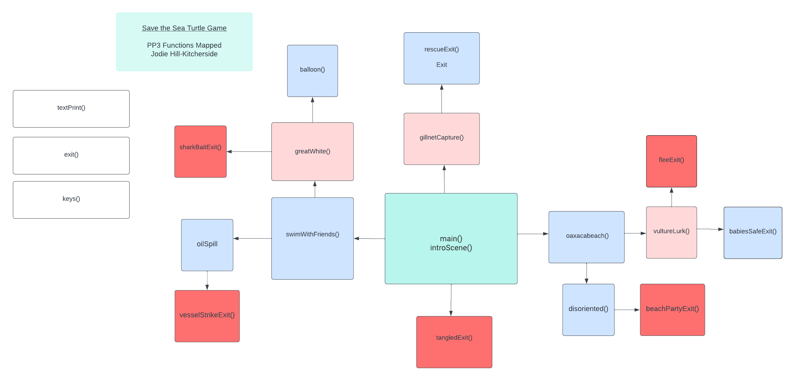 

### Storyline

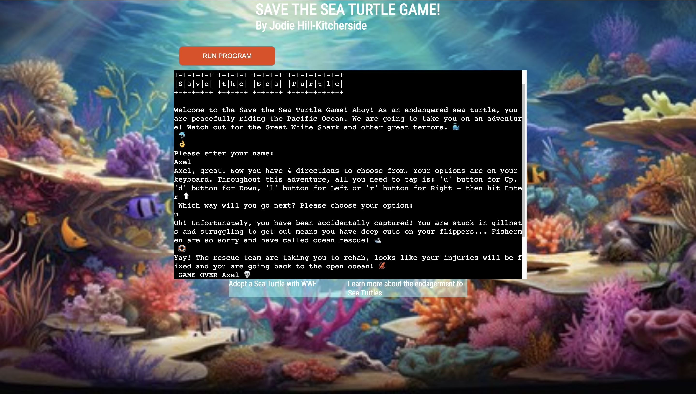
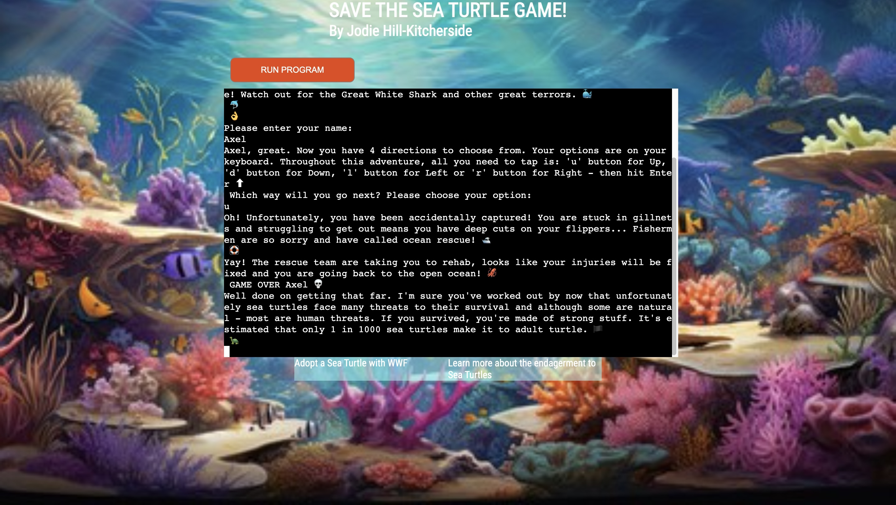
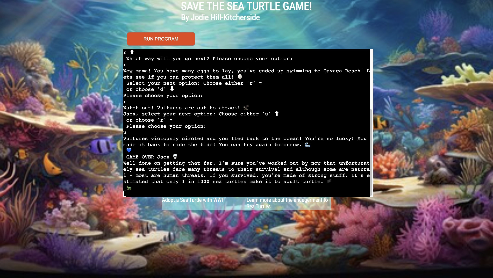

## Existing Features

### Move through inputs 
Inputs have been created to include the user in the game, adding to the user experience within the terminal. First, the user is asked to type their name, then the user is asked to choose from a list of key options: Up, Down, Left and Right. 
The name input is used throughout to draw reference back to the user.

### Code errors 
Wrong or missing inputs will be identified and an error message will appear. 
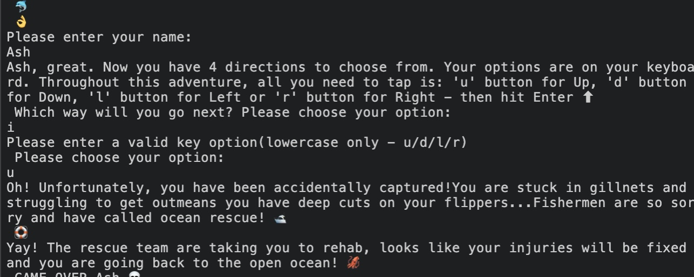 

### While if else functions
Most next steps as you progress throughout the quiz provide a question with two directions to choose from in order to continue. If the user selects from either key, they will progress to the next step in the sea turtle's adventure. If there is another option selected, there will be an error message. 

## Features left to implement

- Key arrows (Up/Down/Right/Left).
- Key options 'backspace' 'esc' and 'quit', to alow the user to go back and try other options. 
- Deeper storyline, more options other than limited death, allowing th user to understand more about the life of that species. 
- Other endangered species games, allowing use to choose which animal to play. 
- Basis for a cool RPG for children and young adults to play for in years to come, when several species have become extinct. For example, we could already create learning around the lift of recently extinct animals: Northern White Rhinocerous, Baiji or Pyrenean Ibex. As many games today are action-adventures and story based, it would be cool for something like this to team up with WWF or the National Geographic for children's fun and learning. 

# Addtional files to support run.py
- Emojis.py hosts the Emoji() class with all emoji unicodes, this is then sourced in run.py and used as part of a string. 
- Statements.py hosts the statements for each function called in run.py that follows the reusable function 'slowPrintExit()'. This was created to simplify code and cut repetition. 

# Frameworks, libraries and modules used 
- Sys used for slowprint() 
- Time used for slowprint() 
- Pyfiglet for termainal header - ASCII art 
- Emojis import Emoji - for emojis.py, run.py and statements.py

## Design

Index.html displays a background image of a vivid colourful ocean bed. White headings and footer have been styled to stand out in the foreground. Opacity for the anchors have been set for readability.
Background image was displayed particualrly to add feel to the user, as this game alone in a terminal and white background was too basic. The background adds to the sotry, making you feel like you are underwater with the seaturtle themself! 

### Validator Testing

This project has been extensively tested.

All possible user input points have been tested to ensure error handling has been taken care of and they call the correct function.
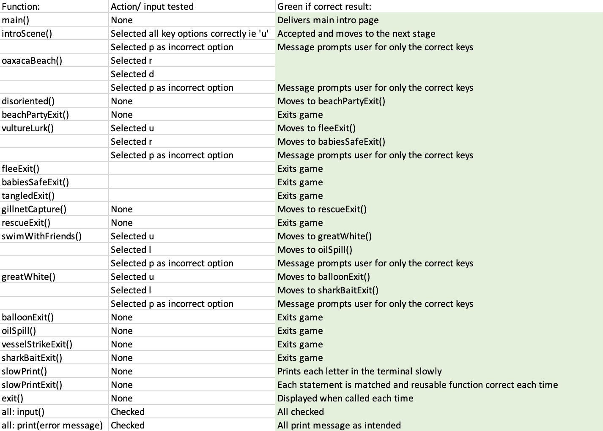 

### PEP8

There are no PEP8 errors.

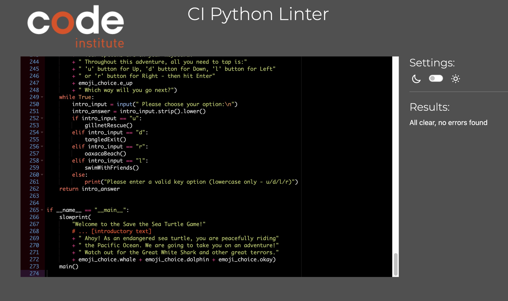 
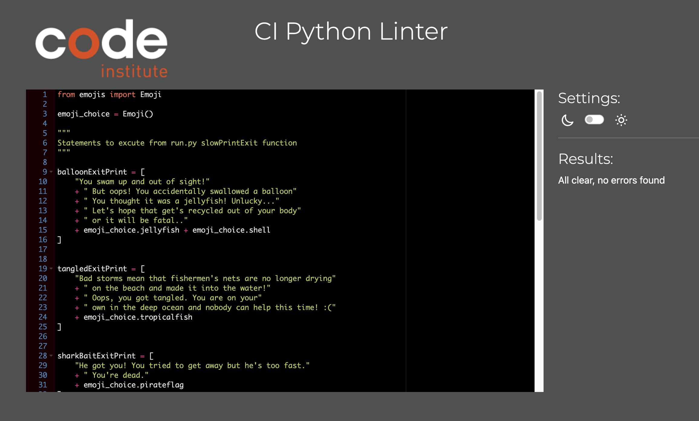 
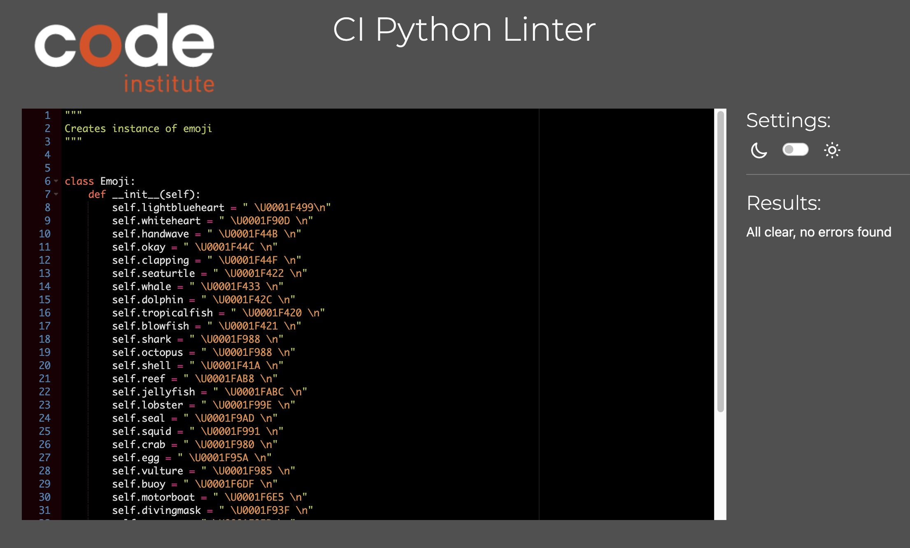 

Pylinter checks:
 

### Solved Bugs

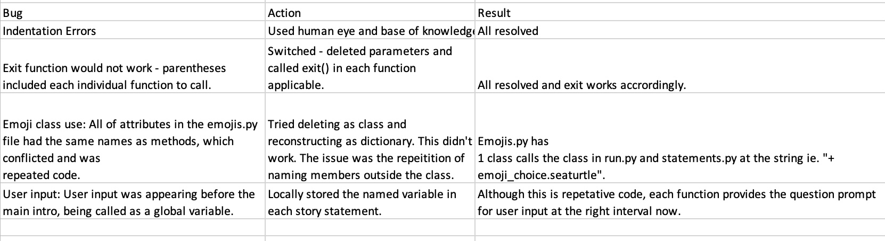

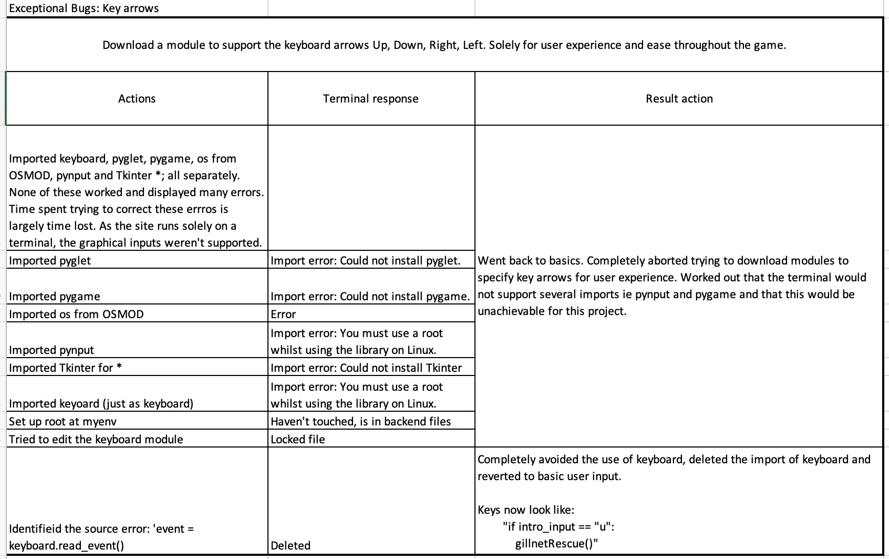 

### Unsolved Bugs

- Could not add an 'esc' or 'quit' function without installing, importing and using the keyboard module. 

## Deployment

The project was deployed using Code Institute's mock terminal for Heroku.
Please view site here: [Save the Sea Turtles](https://save-the-turtles-20dc2dacc172.herokuapp.com/)
)
Please see the steps below exceuted:
1. Go to heroku.com, ensure sign up and logged in 
2. Click Create App
3. First check Settings: 
    - Config vars - if you have a creds.json, allow access (copy creds.json files)
    - Always add build packs - python, node.js (this order) save or click and drag to reorder
4. 	Deploy: 
	- Deployment method - click deploy to GitHub
	- Connect to GitHub and search repo name
	- Enable automatic deploy or manual 

If you choose manual:
- Review build master - check process and click link to view 
- Preview in new tab 

## Credits

### Inspired websites/ books
Python Tricks The Book - Dan Bader 
- 4:3 Defining your own Exception Classes
- 2:4 Underscores, dunders and more  

Invent Your Own Computer Games With Python - Al Sweigart 
- 5 : Dragon Realm 

[Errors on unicode](https://www.geeksforgeeks.org/python-program-to-print-emojis/)

### Tutor/mentor suggestions

- Tutor Oisin suggested the reduction of repeated code to resolve the Emoji() issue. 
- Tutor Sean suggested a minor change for the beachPartyExitPrint() issue. After days of testing and rewriting, needed someone else's eyes even for such a basic mistake!

### Inspiration and content 
[ICUN Red List](https://www.iucnredlist.org/species/11534/3292503)
[Olive Ridley Sea Turtles](https://oliveridleyproject.org/threats-to-sea-turtles)

