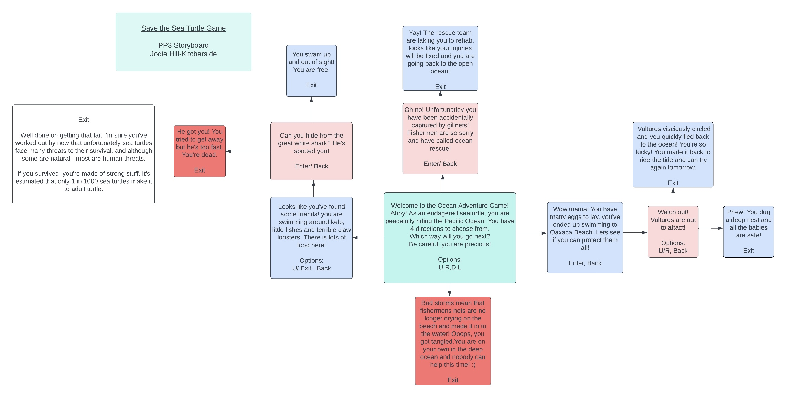

# Save the Sea Turtle Game

The Save the Sea Turtle Game has been created as a mini adventure game, perfect to play as you would have on a gameboy in the early 90s! This mini adventure game follows the real life challenges faced to Sea Turtles, of which all species are either vulnerable or critcially endagered, significantly due to human threats. 
As tragic and morbid as this sounds, the game aims to make a light-hearted fun, and to educate anyone who plays it in a mini adventure episode. 
The quiz' main target market group would be perfect for pre-teen or teenagers, who typically would play adventure games and perfect as it is educational. Of course, this is welcome to all adults to try too!

The game is story based, with four main options to choose the 'sea turtle's next move. This them passes on to various actions. The game is formatted in Python Script, styled as room exploration game. Each option offers the user to use several keys to change direction, giving contol to the user to explore different sequences of the sea turtle's life.

# User Feedback

- ""

# Features

### Storyboard:

This is a basic format used to structure the story for the game.  

### Flowchart planning 
This is a basic structure plan for the code, mapping out the necessary functions to work from.  

## Existing Features

## Code errors 
## Code decorators?
## If else functions

## Features left to implement

## Design

### Validator Testing

## Examples:

### PEP8

### Solved Bugs

### Unsolved Bugs

## Deployment

## Credits

### Inspired websites and tutor/mentor suggestions

### Inspiration and content 

## Reminders

- Your code must be placed in the `run.py` file
- Your dependencies must be placed in the `requirements.txt` file
- Do not edit any of the other files or your code may not deploy properly

## Creating the Heroku app

When you create the app, you will need to add two buildpacks from the _Settings_ tab. The ordering is as follows:

1. `heroku/python`
2. `heroku/nodejs`

You must then create a _Config Var_ called `PORT`. Set this to `8000`

If you have credentials, such as in the Love Sandwiches project, you must create another _Config Var_ called `CREDS` and paste the JSON into the value field.

Connect your GitHub repository and deploy as normal.

## Constraints

The deployment terminal is set to 80 columns by 24 rows. That means that each line of text needs to be 80 characters or less otherwise it will be wrapped onto a second line.

---

Happy coding!
