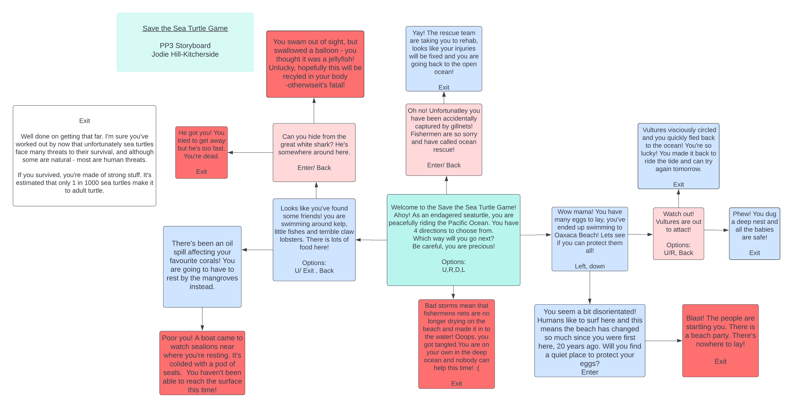

# Save the Sea Turtle Game

The Save the Sea Turtle Game has been created as a mini adventure game, perfect to play as you would have on a gameboy in the 80s! This mini adventure game follows the real life challenges faced to Sea Turtles, of which all species are either vulnerable or critcially endagered, significantly due to human threats. 
As tragic and morbid as this sounds, the game aims to make a light-hearted fun, and to educate anyone who plays it in a mini adventure episode. 
The quiz' main target market group would be ideal for pre-teen or teenagers, who typically would play adventure games and perfect as it is educational. Of course, this is welcome to all adults to try too!

The game is story based, with four main options to choose the 'sea turtle's next move. This them passes on to various actions. 
This formatted in Python Script, styled as a text-based room exploration game. Each option offers the user to use several keys to change direction, giving contol to the user to explore different sequences of the sea turtle's life.

# User Feedback

- ""

# Features

### Storyboard:

This is a basic format used to structure the story for the game.  

### Flowchart planning 
This is a basic structure plan for the code, mapping out the necessary functions to work from.  
 

## Existing Features

### Move through inputs 
Inputs have been created to include the user in the game, adding to the user experience within the terminal. First, the user is asked to type their name, then the user is asked to choose from a list of key options: Up, Down, Left and Right. 
The name input is used throughout to draw reference back to the user.

### Code errors 
Wrong or missing inputs will be identified and an error message and print statement will appear. 

### If else functions
Most next steps as you progress throughout the quiz provide a question with two directions to choose from in order to continue. If the user selects from either key, they will progress to the next step in the sea turtle's adventure. If there is another option selected, there will be an error message. 

## Features left to implement

- Key option 'back', to alow the user to go back and try other options. 

The text-based game could be further developed with images and a more detailed storyline, as with an RPG, like many other nintendo games (Super Mario, Animal Crossing, Legend of Zelda) ideal for the nintendo switch. 
In order to enable this, the storyline would need to be simplified, add mutliple characters and update the functionality. Main character would be identified rather than asking a user to assign a name, and the story would start by introducing this character.

For example : 
"Ahoy Crush! I like the way you're riding the waves! Dude, it's time for an adventure! Your aim is to keep safe and avoid being eaten by the Great White Shark and any other hidden terrors - so watch out.
Which way would you like to go next?" 
Allowing the game to become a RPG would simplify the storyline and make this more unniversal for younger children. 

# Addtional files to support run.py
- General.py hosts 'global' functions such as the slowprint: for all text to add to user experience; escape key:  allows the user to escape the game and return to the intro scene, and the check user input: which checks if input is blank and provides a prompt to user. 
- Emojis.py hosts the Emoji() class with all emoji unicodes, this is then sourced in run.py and used as part of a string. 
- Statements.py hosts the statements for each function called in run.py that follows the reusable function 'slowPrintExit(). This was created to simplify code and cut repetition. 

# Frameworks, libraries and modules used 
- Sys used for slowprint() 
- Time used for slowprint() 
- Pyfiglet for termainal header - ASCII art 
- Emojis import Emoji - for emojis.py, run.py and statements.py

## Design

Index.html displays a background image of a vivid colourful ocean bed. White headings and footer have been styled to stand out in the foreground. 

### Validator Testing

## Examples

### PEP8

### Solved Bugs

- Terminal identified a number of indentation errors - quickly resolved with human eye. 

- Exit function would not work as parentheses included each individual function to call, fixed by calling main function, with all other functions inside. Thus, avoided repetition in code. Added a reusable function.

- Emoji class use: All of attributes in the emojis.py file had the same names as methods, which conflicted and was 
repeated code. Emojis.py has 1 class and calls the class in run.py and statements.py at the string ie. "+ emoji_choice.seaturtle".

### Unsolved Bugs

Key arrows:

- Imported keyboard, pyglet, pygame, os from OSMOD, pynput and Tkinter *; all separately to try to import key arrows for use in a game. As the site runs solely on a terminal, the graphical inputs weren't supported. 
- Instead have reverted to alphanumeric input only and described keys 'u' as Up for example. 

Import error - script running as root:
- Backend error suggesting that I must use a root whilst using the library on Linux. Have installed a root with myenv.

https://stackoverflow.com/questions/7053971/python-trouble-using-escape-key-to-exit
https://stackoverflow.com/questions/25494726/how-to-use-pygame-keydown-to-execute-something-every-time-through-a-loop-while-t
https://stackoverflow.com/questions/56844378/pylint-no-member-issue-but-code-still-works-vscode
https://github.com/Rabbid76/PyGameExamplesAndAnswers/blob/master/documentation/pygame/pygame_keys_and_keyboard_event.md

## Deployment

The project was deployed using Code Institute's mock terminal for Heroku.

Please see the steps below exceuted:
1. Go to heroku.com, ensure sign up and logged in 
2. Click Create App
3. First check Settings: 
    - Config vars - if you have a creds.json, allow access (copy creds.json files)
    - Always add build packs - python, node.js (this order) save or click and drag to reorder
4. 	Deploy: 
	- Deployment method - click deploy to GitHub
	- Connect to GitHub and search repo name
	- Enable automatic deploy or manual deploy

If you choose manual:
- Review build master - check process and click link to view 
- Preview in new tab 

## Credits

### Inspired websites/ books
Python Tricks The Book - Dan Bader 
- 4:3 Defining your own Exception Classes
- 2:4 Underscores, dunders and more  

Invent Your Own Computer Games With Python - Al Sweigart 
- 5 : Dragon Realm 

https://www.geeksforgeeks.org/how-to-print-to-stderr-and-stdout-in-python/ - import sys 
https://www.geeksforgeeks.org/python-program-to-print-emojis/ - errors on unicode 

### Tutor/mentor suggestions
Oisin suggested the reduction of repeated code to resolve the Emoji() issue. 

### Inspiration and content 
https://www.iucnredlist.org/species/11534/3292503
https://oliveridleyproject.org/threats-to-sea-turtles

